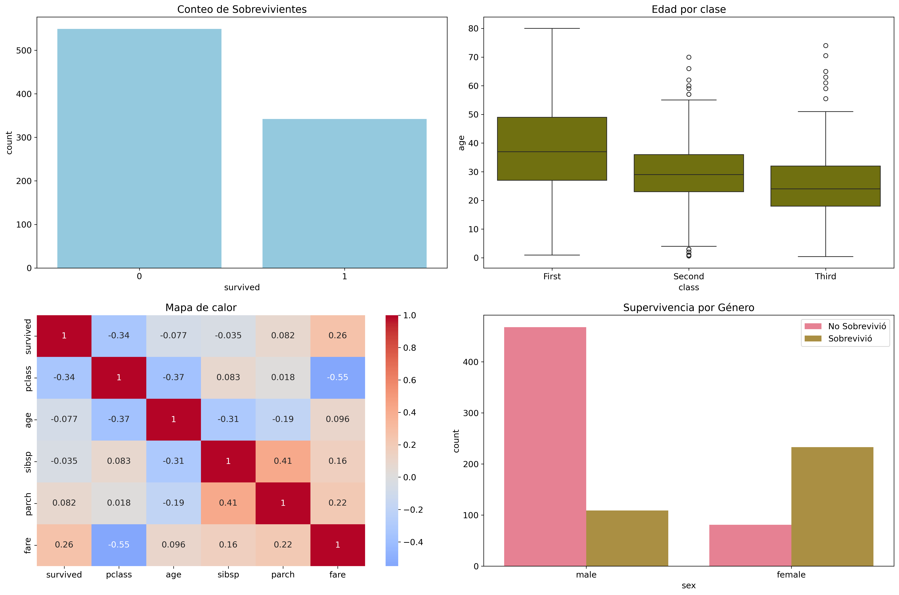
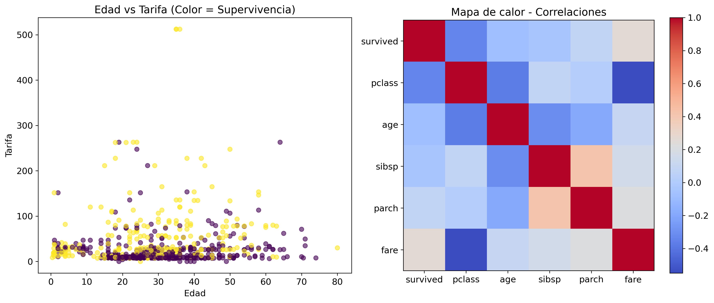
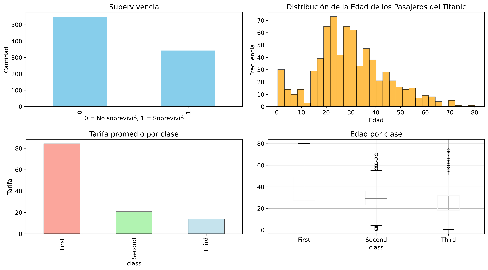

# UEES-IA-Semana1-Grupo 7
# 🧠 UEES – Inteligencia Artificial  
## 📚 Laboratorio Semana 1  
Este repositorio contiene el desarrollo completo del **Laboratorio de la Semana 1** de la materia de **Inteligencia Artificial – UEES**.
Laboratorio práctico de Inteligencia Artificial con Python: 4 notebooks explorando NumPy, Pandas, visualización de datos, Machine Learning y Deep Learning usando el Dataset: Titanic.

Incluye:
- ✔️ 4 notebooks principales desarrollados en Google Colab  
- ✔️ Datasets utilizados en los ejercicios  
- ✔️ Visualizaciones realizadas  
- ✔️ Modelos de Machine Learning y Deep Learning

## 📊 Dataset Empleado
**Dataset**: Titanic Survival Dataset
**Fuente**: Seaborn library datasets
**Descripción**: Datos de pasajeros del RMS Titanic incluyendo información demográfica, clase de boleto, ubicación y estado de supervivencia.

**Características principales**: 891 registros de pasajeros - 12 variables (demográficas, socioeconómicas, ubicación)

---

## 📁 Contenido del repositorio

### 🔹 1. Fundamentos: NumPy y Pandas  
**Notebook:** `01_Fundamentos_NumPy_Pandas.ipynb`  
Incluye:
- Creación y manipulación de arrays NumPy  
- Operaciones vectorizadas  
- Series y DataFrames en Pandas  
- Limpieza y transformación básica de datos  

---

### 🔹 2. Visualización de Datos  
**Notebook:** `02_Visualizacion_Datos.ipynb`  
Incluye:
- Gráficos básicos y avanzados con Matplotlib  
- Visualizaciones estadísticas con Seaborn  
- Histogramas, scatter plots, heatmaps, boxplots  
- (Opcional) Gráficos interactivos con Plotly  

---

### 🔹 3. Machine Learning Básico  
**Notebook:** `03_Machine_Learning_Basico.ipynb`  
Incluye:
- Entrenamiento de modelos de clasificación  
- División entrenamiento/prueba  
- Estandarización de variables  
- Métricas: Accuracy, Precision, Recall, F1  
- Comparación entre algoritmos  

---

### 🔹 4. Introducción a Deep Learning  
**Notebook:** `04_Deep_Learning_Intro.ipynb`  
Incluye:
- Perceptrón multicapa con TensorFlow/Keras  
- Entrenamiento y validación  
- Visualización del proceso de aprendizaje  
- Evaluación del modelo  

---
## Instalación y Configuración

### Prerrequisitos
- Python 3.7 o superior
- Google Colab o Jupyter Notebook
- Acceso a internet para descarga de datasets

### 🛠️ Requerimientos
Archivo `requirements.txt` incluido para garantizar la correcta ejecución de los notebooks

---

## Resultados principales

- Las mujeres presentaron mayor tasa de supervivencia a diferencia de los hombres.

- La edad y la tarifa están correlacionadas fuertemente con la sobrevivencia

- Así también los pasajeros de primera clase tuvieron mayor probabilidad de sobrevivencia.
- Los pasajeros de primera clase tuvieron mejores probabilidades de supervivencia

---

## 📌 Autor
**Nombre**: César Cabrera, Ana Lucía Espinoza, Andrea Ordoñez, Andrea Tapia  
**Email**: cesar.cabrerav@uees.edu.ec - ana.espinozaa@uees.edu.ec - andrea.ordonezr@uees.edu.ec - andrea.tapian@uees.edu.ec

**Institución**: Universidad Espíritu Santo - UEES  
**Programa**: Maestría en Inteligencia de Negocios y Ciencia de Datos  
**Curso**: Inteligencia Artificial
